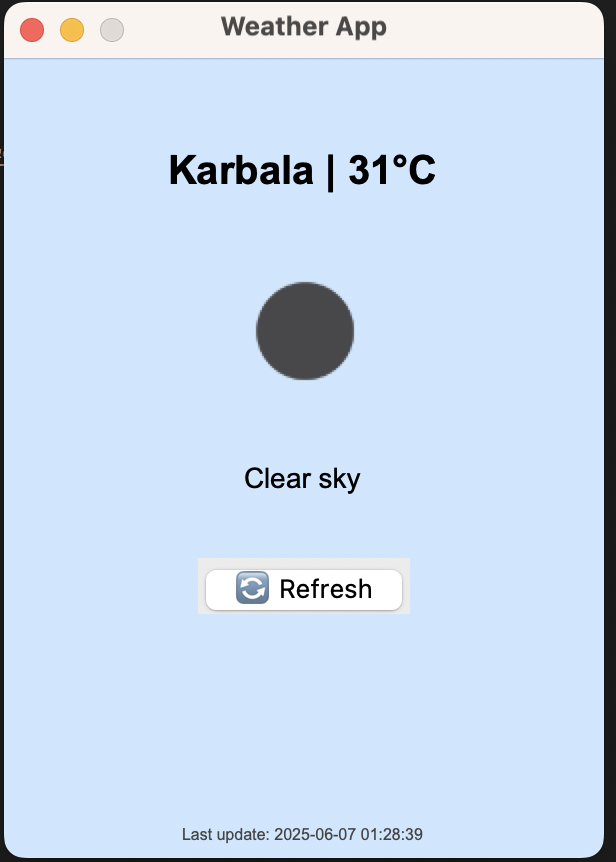

# 🌤️ Python Weather App

A simple and beautiful desktop weather application built with Python and Tkinter.  
It fetches real-time weather data from **OpenWeatherMap** for a default location (🇮🇶 Karbala, Iraq) and presents it with a clean and graphical user interface.

---

## ✨ Features

- 📍 Default weather info for Karbala, Iraq
- 🌡️ Real-time temperature and description
- 🌄 Weather icons (auto-loaded from OpenWeatherMap)
- 🔄 Refresh button to update data instantly
- 🎨 Clean, minimal, and responsive UI
- ✅ No database required — works out of the box

---

## 🛠️ Requirements

- Python 3.x
- `requests` module
- `Pillow` module (for image processing)

Install dependencies:

```bash
pip install requests pillow
```

---

## 🔑 Setup API Key

1. Go to [OpenWeatherMap](https://openweathermap.org/api) and create a free account.
2. Get your API key.
3. Open `main.py` and replace:

```python
API_KEY = "your_openweathermap_api_key"
```

with your actual API key.

---

## ▶️ Run the App

```bash
python main.py
```

---

## 📸 Screenshot



---

## 🙌 Author

Made with ❤️ by [Mostafa Baghi](https://github.com/mostafabaghi)